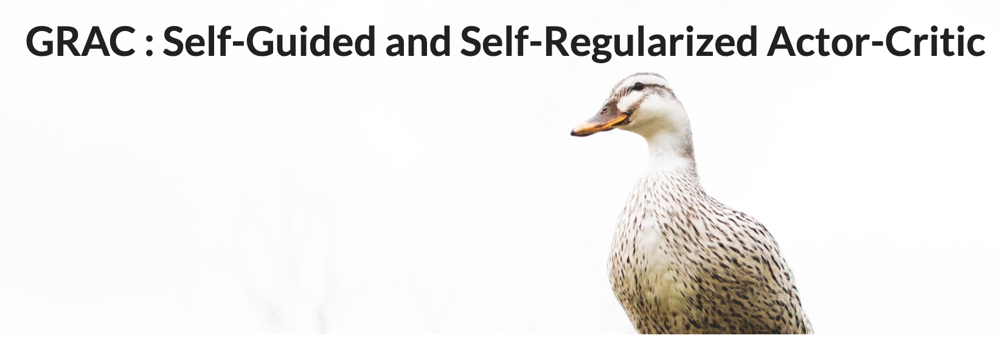

Deep reinforcement learning (DRL) algorithms have successfully been demonstrated on a range of challenging decision making and control tasks. One dominant component of recent deep reinforcement learning algorithms is the target network which mitigates the divergence when learning the Q function. However, target networks can slow down the learning process due to delayed function updates. Another dominant component especially in continuous domains is the policy gradient method which models and optimizes the policy directly. However, when Q functions are approximated with neural networks, their landscapes can be complex and therefore mislead the local gradient.  In this work, we propose a self-regularized and self-guided actor-critic method. We introduce a self-regularization term within the TD-error minimization and remove the need for the target network. In addition, we propose a self-guided policy improvement method by combining policy-gradient with zero-order optimization such as the Cross Entropy Method. It helps to search for actions associated with higher Q-values in a broad neighborhood and is robust to local noise in the Q function approximation. These actions help to guide the updates of our actor network.  We evaluate our method on the suite of OpenAI gym tasks, achieving or outperforming state of the art in every environment tested.

[Project Webpage](https://sites.google.com/view/gracdrl)

## Requirement
```
python >= 3.6;
mujoco >= 2.0;
mujoco-py;
```

## Run the code
```
python main.py --policy GRAC --env Ant-v2 --max_timesteps 3000000 --which_cuda 0 --seed 0 --exp_name exp_Ant
```

If you think our work is useful, please consider citing use with
```
@article{shao2020grac,
  title={GRAC: Self-Guided and Self-Regularized Actor-Critic},
  author={Lin Shao and Yifan You and Mengyuan Yan and Qingyun Sun and Jeannette Bohg},
  journal={arXiv preprint arXiv:2009.08973},
  year={2020}}
```
